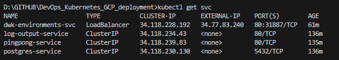

# Assignment

> Setup automatic deployment for the project as well.
> 
> Hints:
> 
> - If your pod uses a Persistent Volume Claim access mode [ReadWriteOnce](https://kubernetes.io/docs/concepts/storage/persistent-volumes/#access-modes), you may need to consider the deployment [strategy](https://kubernetes.io/docs/concepts/workloads/controllers/deployment/#strategy), since the default (RollingUpdate) may cause problems. Read more from the [documentation](https://kubernetes.io/docs/concepts/workloads/controllers/deployment/#strategy). The other option is to use an [access mode](https://kubernetes.io/docs/concepts/storage/persistent-volumes/#access-modes) that allows many pods to mount the volume.
> - If you are using Ingres, remember that it expects a service to give a successful response in the path / even if the service is mapped to some other path!


# Solution

```bash
kubectl get svc
kubectl describe svc dwk-environments-svc
```

## Frontend

